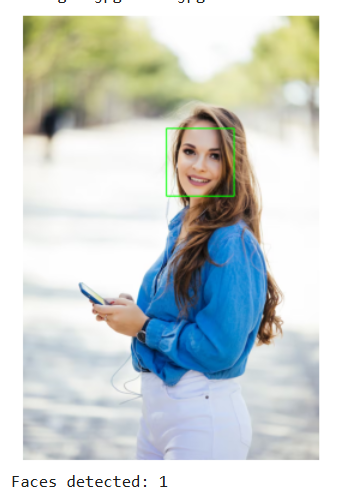

# Face-Detection-using-OpenCV-Image-Video-
This project demonstrates Face Detection using Python and OpenCV. It can detect human faces in both images and videos by using the Haar Cascade Classifier — a pre-trained model for facial recognition.

### Features

- ✅ Detects faces in static images  
- ✅ Performs real-time face detection in videos (frame by frame)  
- ✅ Draws bounding boxes around detected faces  
- ✅ Saves the processed output video  
- ✅ Works perfectly on Google Colab or any Python environment  

## 🖼️ Image Output  

## 🎬 Video Output  
[Click here to watch the output video](video_output/output_video.mp4)

